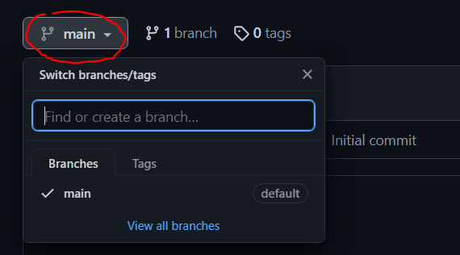

# Laboratório de POO - C206

## Introdução 🙂

Bem-vindo(a) ao respositório do laboratório da disciplina **C206 - Programação Orientada a Objetos (POO)**.

## Acesso às Aulas 👨‍🏫

Para acessar as aulas da disciplina, basta selecionar a `main` _branch_ acima, conforme mostra a imagem abaixo, e mudar a _branch_ para a aula desejada.

Cada _branch_ terá um conteúdo diferente e contará com o material para a aula, bem como o [_link_ para o Notion](https://swanky-tamarind-bf3.notion.site/C206-16e72a7aebd6465bb7c22d6123c8449e).

Qualquer dúvida, estou à disposição! 😉
