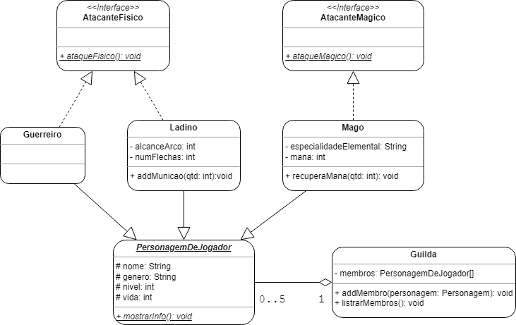

# Relatório Prático 02

## Questão Única (100 pts.)

### Ambientação

Você, como programador(a), foi contratado(a) para auxiliar no desenvolvimento de um jogo RPG, situado em um clássico mundo de fantasia, com direito a elfos e dragões. Nele, cada jogador pode criar um personagem para compôr uma guilda, mas cada um deles deve pertencer a uma das três classes disponíveis, sendo elas: **Guerreiro**, **Ladino** ou **Mago**.

### Implementação

Agora que você já tem uma ideia melhor do jogo, considere o seguinte diagrama de classes:

Agora, faça o seguinte:

1. (50 pontos) Desenvolva um programa estruturado conforme o diagrama acima.
2. (20 pontos) Na função principal (`main`), crie no mínimo um personagem de cada tipo: um **Guerreiro**, um **Ladino** e um **Mago**. Então, preencha todos os seus atributos e adicione-os a uma `Guilda` através do método `addMembro`.
3. (30 pontos) No final, liste todos os personagens e execute todos os métodos dentro execute todos os métodos de cada personagem. Para os métodos que tem algum funcionamento restrito a algum recurso, como mana ou munição, execute-os em _loop_ até que não seja mais possível utilizá-los.

### Observações

Segue algumas informações adicionais do sistema:

- O `Guerreiro` pode atacar inimigos causando dano físico, mas ele utiliza apenas armas de curta distância, como espadas, lanças, maças etc.
- O `Ladino` também causa dano físico, mas utiliza exclusivamente seu arco e flecha. Caso ele não tenha mais munição, não consegue atacar. Mostre o alcance do ataque, também.
- O `Mago` tem uma especialidade elemental e pode atacar utilizando dela. Por exemplo, pode atacar com fogo, com água, com gelo etc, a depender de sua especialidade. Entretanto, cada ataque mágico tem um custo de mana e, caso sua mana chegue a zero, ele não poderá realizar o ataque.
- Uma `Guilda` pode ter, no máximo, 5 jogadores, mas cada jogador só pode estar em uma guilda.
- A classe `PersonagemDeJogador` deve ser abstrata. Todas as classes e métodos abstratos, além de estarem em _itálico_, também foram sublinhados para que não haja confusão.

### Recomendações

- Não é necessário fazer entrada de dados e portanto não é necessária a utilização de `Scanner`. Objetos deverão ser instanciados diretamente na função principal (`main`).
- Lembre-se de instanciar objetos em cada posição do _array_, ou comparar a posição com `null` (`array[posicao] != null`) para evitar amostra de valores nulos. Trate devidamente os dados!
- Crie _arrays_ de tamanhos razoáveis para as funcionalidades que estão sendo desenvolvidas.
- Utilize boas práticas para criação de atributos e métodos, como nomes significativos.
- Preencha todos os atributos das classes e não esqueça dos _Getters_ e dos _Setters_ para os atributos `private`, caso necessário.
